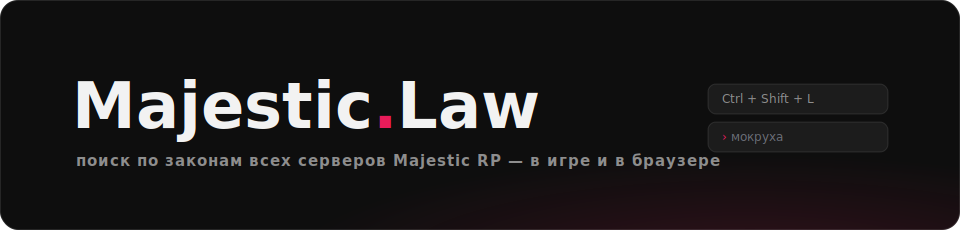
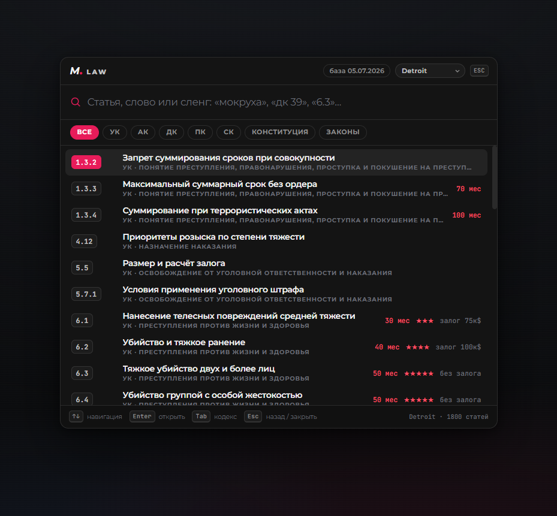
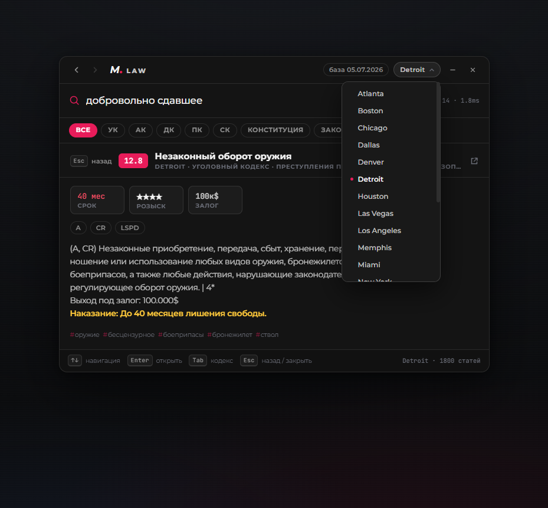

<p align="center"></p>

Оверлей с законами для Majestic RP. Жмёшь `Ctrl+Shift+L` поверх игры — открывается поиск по всем кодексам и законам твоего сервера. Наказания, розыск и залог видны прямо в списке, без лишних кликов.

Работает как обычное окно поверх экрана, ничего не инжектит в игру. GTA нужно перевести в режим «оконный без рамки».



## Что умеет

- поиск по номеру («6.3», «дк 39»), по тексту и по сленгу — «мокруха», «ствол», «травка» находят нужные статьи
- опечатки прощает, «убиство» тоже найдётся
- все 19 серверов, переключение в два клика
- карточка статьи: санкции плитками, флаги, ссылка на форум, кликабельные отсылки к другим статьям
- сравнение статьи между всеми серверами — видно, где сколько дают
- пин: `Ctrl+P` вешает статью маленьким окном поверх экрана, с регулировкой прозрачности
- работает без интернета, база зашита внутрь
- трей, запоминание позиции окна, история навигации как в браузере



## Установка

Готовый exe лежит в [releases](../../releases). Скачал, запустил, свернулось в трей — дальше `Ctrl+Shift+L`.

Собрать самому:

```
# нужен Rust и WebView2 (в Windows 11 уже есть)
node scripts/fetch-db.js   # подтянуть базу законов в app/data
cd src-tauri
cargo build --release
```

## Горячие клавиши

| | |
|---|---|
| `Ctrl+Shift+L` | показать / спрятать |
| `↑` `↓` `Enter` | навигация по списку |
| `Tab` | переключить кодекс |
| `Ctrl+P` | закрепить статью поверх экрана |
| `Alt+←` `Alt+→` | назад / вперёд |
| `Esc` | назад, потом спрятать |

## Веб-версия

То же самое в браузере, плюс страницы законов для чтения, ченджлог изменений и тренажёр для подготовки к собесам в гос: папка `docs/`, разворачивается на GitHub Pages как есть.

## База

Законы скрапятся с официального форума и лежат отдельным репозиторием — [Majestic-Law-DB](https://github.com/h3xbleed/Majestic-Law-DB). Там же ченджлоги: что поменялось, в каких статьях, с каких санкций на какие. Приложение умеет подтягивать свежую базу само (см. `app/config.js`).

## Лицензия

Код — GPLv3. База законов — CC BY-NC-SA 4.0, подробности в репо базы. Проект не связан с администрацией Majestic RP; тексты законов принадлежат их авторам на форуме.
